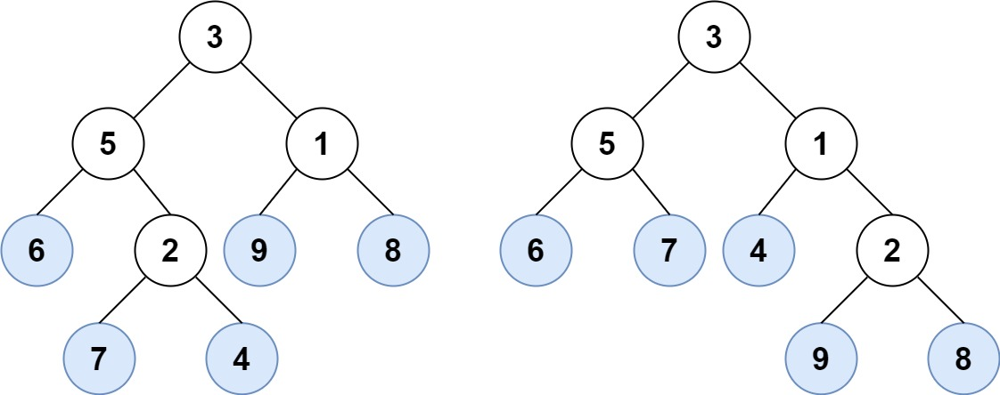

# Solution

[872. Leaf-Similar Trees](https://leetcode.com/problems/leaf-similar-trees/?envType=study-plan-v2&envId=leetcode-75)

This Leetcode problem is about finding whether the leaves of the given two binary trees are same. A node that has no children is called a leaf node, together they are called leaves. So basically without leaf nodes a binary tree would never end. Two trees are considered leaf-similar if their leaf value sequence(all the leaves of a binary tree from left to right order) is the same.

In the above image, there are two binary trees, the first binary tree's leaf value sequence from left to right order is `[6,7,4,9,8]` which is same as the second binary tree's leaf value sequence `[6,7,4,9,8]`. So in this case our function should return true since the leaf value sequence of the binary trees are same.

## How to solve the problem?

Using the DFS method go deep into the graph through a single path and get the value of the leaf node and store it in a data structure. Now backtrack to the previous node and repeat the same until it reaches the right most leaf node.

## Coding Solution

Depth First Search can be implemented in two ways, iterative approach and recursive appraoch. In this solution i will be using recursive approach.

Inside the function `leafSimilar` which takes two arguments `root1` and `root2`, two binary trees, create a function `findLeafSequence` which takes a binary tree `node` and an empty array `seq` as inputs and returns its leaf value sequence as an array.

Inside the `findLeafSequence` function, check whether the current node is `null`, if it is `null` return. Next check if the current node's left and right child are `null`. If both the left and right child values are `null` then it is a leaf node. In that case push the value of that node into the `seq` array and return. This is the base case for this function.

Now call the same function `findLeafSequence` recursively for the both the left child and right child of the current node separately. The first argument is the node and the `seq` array is the second argument. The leaf values are pushed into the `seq` array in place, so it gets updated in the subsequent calls.

Now the function `findLeafSequence` is defined, Initialize two empty arrays `root1LeafSequence` and `root2LeafSequence`. Call the function `findLeafSequence` with the input `root1` and `root1LeafSequence` and with the input `root2` and `root2LeafSequence`.

Once we have both the binary tree's leaf value sequence check whether all the values are same and return a boolean if it is same or false if there is a mismatch.

- `findSequence(3, [])`
  - `findSequence(5, [])`
    - `findSequence(6, [])` -> Adds `6`: `[6]`
    - `findSequence(2, [6])`
      - `findSequence(7, [6])` -> Adds `7`: `[6, 7]`
      - `findSequence(4, [6, 7])` -> Adds `4`: `[6, 7, 4]`
  - `findSequence(1, [6, 7, 4])`
    - `findSequence(9, [6, 7, 4])` -> Adds `9`: `[6, 7, 4, 9]`
    - `findSequence(8, [6, 7, 4, 9])` -> Adds `8`: `[6, 7, 4, 9, 8]`
